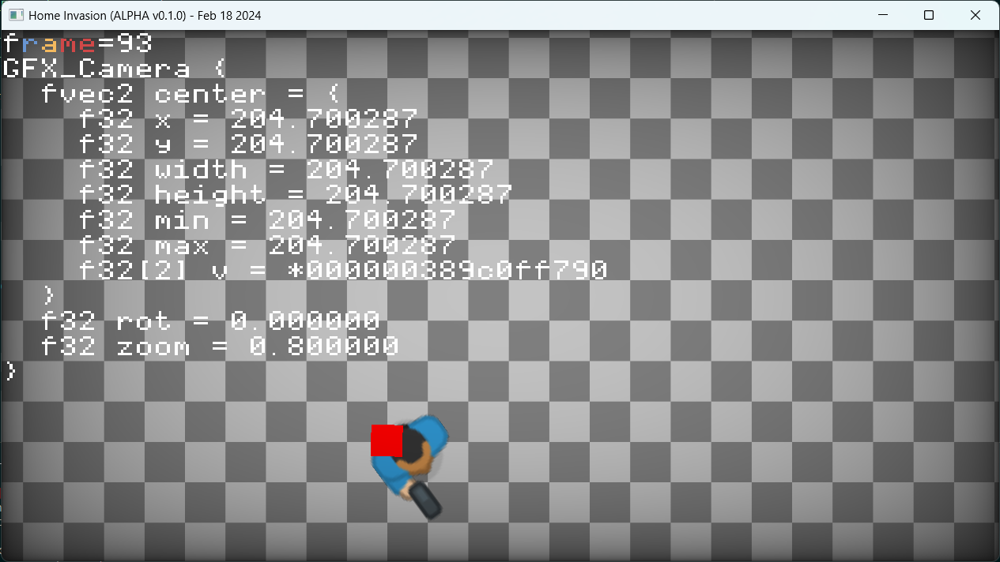

# ... a video game project!?

This is a wanna-be commercial video game project with long way to go ;)

## About the Tech

Since You're most likeley here from my CV, here are some details:

- it's a low-level, C-like C++ (aka Orthodox C++) code
- aim is to be as independent as possible from 3rd party libraries
- the code is structured in layers, see [notes](doc/notes.md), which form a direct acyclic graph
- I use ASAN, clang-tidy, clang-format, clangd, clang static analyzer, so I can say I care about quality :)
- the code is managing memory using arenas
- to build simply use `build.bat`
- the project is inspired by [RAD Debugger Project](https://github.com/EpicGames/raddebugger)

## About the Game

My current ideas are written in [game notes](doc/game.md). Basically, I want a Hotline Miami with zombies and tower defence kind of stuff.

## Building

You need `clang++`.  
Run `build.bat`, probably the simplest is just `build debug`. See `build --help` for other options.

## Screens

It's in early stage...! But at least does not crash ;)

## License

Basic [MIT](LICENSE.md), nothing fancy. :)
