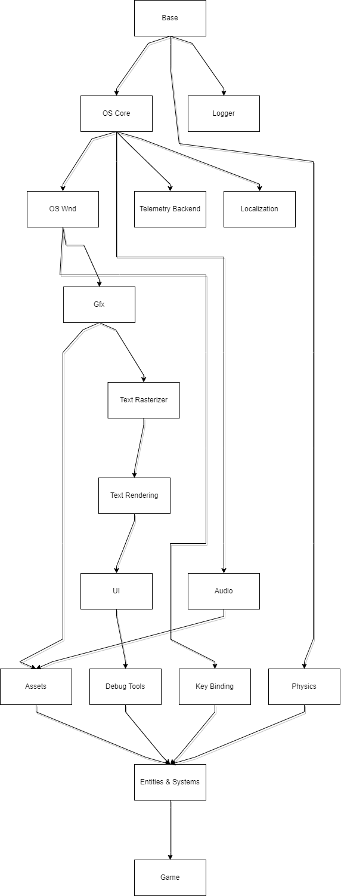

# Game Layers
  
  

## Audio

    [ ] Enumerate available audio devices
    [ ] Frontend design (play_sound("blah"))
    [ ] Backend things (how to handle mastering and loading voices?)

## Assets

    Fonts, textures, texture atlases (XML data?), audio files, level files, config files, save files...

    [ ] list of resources that can be accessed with their IDs / handles?

## Base

    [ ] Save logs to file
    [ ] Rand (perlin noise, random range)
    [ ] Pool allocator -- it should work like the cache of reusable objects

## Debug Tools

    [ ] Physics visualisation - shapes, AABBs, contacts, origin points
    [ ] Frame Time Graph
    [ ] Menu with toggable flags, for example for debug view of physics system
    [ ] Debug text rendering (at least maybe boxes around text?)
    [ ] Render graph visualsation
    [ ] Menu with Entity information...?

## Entities & Systems

    [ ] A* -- used for AI in pathfinding and GOAP!
    [ ] List of systems to update. Maybe sort by priority?
    [ ] Game state machine. This is just a list of systems to run.
      - pause
      - game
      - menu

    Rough system ideas:
    - physics system
    - pathfinding system (coupled to physics system? just needs to know about static geometry and dangers, right?)
    - rendering system? that gathers all entities and their states and determines what should be rendered? (so, clipping?)
    - ai system
    - trap building system (tightly coupled with player interaction I think?)
    - trap logic system (what should happen if triggered etc)
    - player interaction system (handling input?)
      - https://gamedev.stackexchange.com/a/72459
    - enemy interaction system (should it exist? wouldn't AI cover everything?)
    - entity management stuff (killing / spawning entities logic)
    - animation system (just simple sprite sheet for now? later bones)
    - sound system?
    - gun system (reloading animations, recoil...?)
    - playback system? maybe?
    - wave logic system (what to spawn, where) / level management system?
    - game master system (is it a system?) for managing scenes (menu -> game, saving, loading new levels). maybe it should be higher, above the systems?
    
    - shop system
    - money system..?
    - pick ups system

    - all kind of debug subsystems? for some diagrams, drawing, debug UI

    - Level of detail handling

## Game

    Just app initialization.

## GFX

  [ ] Refactor plz
    - ability to draw not only rects but triangle batches too
    - easier debugging pls
    - why the fuck do we silently fail when layer is not specified??
    - The code is full of repetitions and not robust. Also, fix poor resource handling, or actually lack of it.
    - Perhaps render graph nodes can be dealt with similarly to how UI_Widget is being constructed -
      instaed of doing tagged union maybe we could have a `Graph_Node_Flag` or something?
  [ ] Common shapes rendering, mostly for debugging support.
    [ ] Arrow
    [ ] Filled arrow
    [ ] Circle
    [ ] Filled circle

  [ ] Make it easier to select if we render a UI object or game object.

  [ ] Borderless fullscreen should work on either monitor, not only the main one
  [ ] Figure out common viewport sizes that we can render
    Common aspect ratios and their resolutions (via Steam HW Survey):
    - 16:9  (85% of users)  1920x1080  (60% of users)
    - 16:10 (7% of users)   2560x1600  (3% of users)
    - 21:9  (3% of users)   3440x1440  (2% of users)

    I guess the best option will be to stick with 16:9, 1080p and letterboxing
    in other aspect ratios. Although, we should support other resolutions.

  [ ] GPU info (memory, name...)
  [ ] GPU render time

    - variable refresh rate: https://walbourn.github.io/care-and-feeding-of-modern-swap-chains-3/
    and https://learn.microsoft.com/en-us/windows/win32/direct3ddxgi/variable-refresh-rate-displays

  [ ] Particle effects

    We need textures and noise:
    https://www.youtube.com/watch?v=wvK6MNlmCCE

  [ ] Shadows
    What? How? Would be cool if the game takes place at night.

  [] Lights? Maybe? Again, what kind lights? Would be cool if shooting weapons make light effects and
  particle effects would generate light

## Key Bindings

  [ ] Basic array that maps key id to button ID and updates the state of the bindings depending on
  the OS events.
  [ ] Support for default, primary and secondary bindings and rebinding logic

## OS Core

  [ ] OS layer callbacks (init/loop/shutdown)
  [ ] Filesystem  
  [ ] Threads
  [ ] Mutexes
  [ ] File Watch (notify when file updates) / Hot Reload
  [ ] SEH / crash handling
    [ ] Determine what exceptions to catch
    [ ] write minidump
    [ ] write log and error context to the crash info
  [ ] OS Information  
    [X] Memory (RAM)
    [ ] CPU family, cache, frequency
    [ ] SIMD detection

## OS Gfx

    [ ] Monitor enumeration

## Physics

## **new** Serialization

  [ ] Key bindings
  [ ] Program options (volume, window mode)
  [ ] Saves (so, unlocked characters / weapons...? we don't really have much to save)
  [ ] Entities definitions (parameters for zombies, weapons, player movement, level generation...)

## Telemetry

    Basically, use the microseconds timer to time some functions in instrumented release-with-debug-info build.
    Mainly we're interested in frame times and GPU render time

## Text Rasterizing

    Use DirectDraw or freetype to render fonts?
    We will probably use it later. For now, just take ready made fonts.

## Logging

## Localization

    Works by mapping numerical IDs to UTF-8 strings in a cache.
    Cache is read from disk or google docs (need sockets for that).

## Text Rendering

    Only monospace fonts for simplicity?
    
    [X] Font utility. Is it monospace? Get tex rect for given character (aka glyph?) 
    [X] Add code from BB for simple font rendering
    [ ] Rendering to a render target and manipulating it
      [ ] Figure out how to deal with render graph. Just add nodes to it for every text?
        Since the font is monospace we could simply figure out how big the render target should
        be, then render to it easily via render graph.
      [ ] Handle transforms
    [ ] Handling rich text 
      [X] Handling \n and \t
      [X] color (maybe escape codes?)
      [ ] Figure out styles bold, italic, underline etc?

    [ ] Functionality to precalculate text size without rendering it (useful for UI)

## UI

  [ ] Figure out why UI does not react when window size changes (projection/camera issue?)
  [ ] Input handling
  [ ] Checkbox Widget flags

### UI Implementation notes

## Misc

  How to support content creation? And playtesting?
