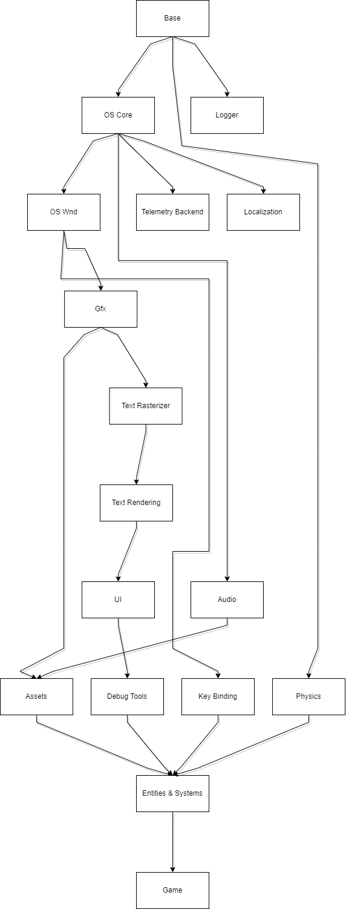

# Game Layers
  
  

## Audio

    [ ] Enumerate available audio devices
    [ ] Frontend design (play_sound("blah"))
    [ ] Backend things (how to handle mastering and loading voices?)

## Assets

    List of textures and audio files...
    [ ] list of resources that can be accessed with their IDs / handles?

## Base

    [ ] Rand (perlin noise, random range)
    [ ] Block (Pool) Allocator
      We have some common sizes of blocks (16, 32, 64, 96 ... 512 bytes). Each block has its
      own free/used list. 
      When an allocation needs to be done, we round the size up to the first available block size.
      This allocator is a good choice for things that are small and allocated in lists, but need to
      live longer than 1 frame and perhaps need to be removed, like physics or game objects.

## Debug Tools

    [ ] Physics visualisation - shapes, AABBs, contacts, origin points
    [ ] Frame Time Graph
    [ ] Menu with toggable flags, for example for debug view of physics system
    [ ] Debug text rendering (at least maybe boxes around text?)
    [ ] Render graph visualsation
    [ ] Menu with Entity information...?
    [ ] In-game logger / debug console (do we need commands if we have debug ui?)

## Entities & Systems

    [ ] List of systems to update. Maybe sort by priority?

    Rough system ideas:
    - physics system
    - pathfinding system (coupled to physics system? just needs to know about static geometry and dangers, right?)
    - rendering system? that gathers all entities and their states and determines what should be rendered? (so, clipping?)
    - ai system
    - trap building system (tightly coupled with player interaction I think?)
    - trap logic system (what should happen if triggered etc)
    - player interaction system (handling input?)
    - enemy interaction system (should it exist? wouldn't AI cover everything?)
    - entity management stuff (killing / spawning entities logic)
    - animation system (just simple sprite sheet for now? later bones)
    - sound system?
    - gun system (reloading animations, recoil...?)
    - playback system? maybe?
    - wave logic system (what to spawn, where) / level management system?
    - game master system (is it a system?) for managing scenes (menu -> game, saving, loading new levels). maybe it should be higher, above the systems?
    
    - shop system
    - money system..?
    - pick ups system

    - all kind of debug subsystems? for some diagrams, drawing, debug UI

    - Level of detail handling

    What about tools? What kind of tools, how to design the code for them?
    Some kind of animation editor? Level editor? Trap editor? Also, would it be better
    than just editing config files? I don't think so...
    Entity inspector / editor. When we will have the guns/traps it would be cool to edit the
    stats on the fly and save the best feeling options. Also for movement and camera system.

## Game

    Just app initialization.

## GFX

  [ ] Common shapes rendering, mostly for debugging support.
    [ ] Arrow
    [ ] Filled arrow
    [ ] Circle
    [ ] Filled circle

  [ ] Make it easier to select if we render a UI object or game object.

  [ ] Figure out common viewport sizes that we can render
    Common aspect ratios and their resolutions (via Steam HW Survey):
    - 16:9  (85% of users)  1920x1080  (60% of users)
    - 16:10 (7% of users)   2560x1600  (3% of users)
    - 21:9  (3% of users)   3440x1440  (2% of users)

    I guess the best option will be to stick with 16:9, 1080p and letterboxing
    in other aspect ratios. Although, we should support other resolutions.

  [ ] GPU info (memory, name...)
  [ ] GPU render time

    - variable refresh rate: https://walbourn.github.io/care-and-feeding-of-modern-swap-chains-3/
    and https://learn.microsoft.com/en-us/windows/win32/direct3ddxgi/variable-refresh-rate-displays

  [ ] Particle effects

    We need textures and noise:
    https://www.youtube.com/watch?v=wvK6MNlmCCE

  [ ] Shadows
    What? How? Would be cool if the game takes place at night.

  [] Lights? Maybe? Again, what kind lights? Would be cool if shooting weapons make light effects and
  particle effects would generate light

## Key Bindings

  [ ] Basic array that maps key id to button ID and updates the state of the bindings depending on
  the OS events.
  [ ] Support for default, primary and secondary bindings and rebinding logic

## OS Core

    [ ] Filesystem 
    [ ] Threads
    [ ] Mutexes
    [ ] File Watch (notify when file updates) / Hot Reload
    [ ] SEH / crash handling
      [ ] Determine what exceptions to catch
      [ ] write minidump
      [ ] write log and error context to the crash info
    [ ] OS Information, 
      [ ] Memory (RAM)
      [ ] CPU family, cache, frequency
      [ ] SIMD detection

## OS Gfx

    [ ] Monitor enumeration

## Physics

- basic collision resolution (no overleap)
- force-field based explosions
- traps that move the zombies around (like catapult, for example)
- BVH and static object to improve performance
  - we can take the result from BVH and distribute it among threads to calculate narrow phase manifolds, since we know which objects can collide with which. Then resolve the collisions in one thread again.

  [ ] v1
    [X] Fixed timestep loop
    [X] Intergrate velocities and impulses...
    [ ] Detect collisions using SAT
    [ ] Raycasting (for shooting, unless we wanna have physical bullets?)

  [ ] v2
    [ ] Collision resolution using impulses
      Figure out the logic behind it because I don't really get the idea of calculating incident faces etc.

    [ ] Broad phase with AABB
      [ ] Generate BVH every frame for all objects?

  [ ] v3
    [ ] Static (immovable) objects / Dynamic objects distinction
      [ ] Generate separate BVH for them
    [ ] Dynamic BVH
    [ ] 'Fat' AABBs?
    [ ] Cleanup

### Resources

  Islands (multithreading!): <https://box2d.org/posts/2023/10/simulation-islands/>
  Erin's Solver2D: <https://box2d.org/posts/2024/02/solver2d/>

  Box2D 3.0 uses Temporal Gauss-Seidel (TGS) solver. We can do sub-stepping without updating the broad-phase or recomputing the contact points.

  Smaller steps are more effective than more iterations.

  Soft constraints. Keep constaint HZ below the simulation step (for 60HZ keep 30HZ).

- mass coefficient
- bias coefficient
- impulse coefficient

  ```cpp
    float zeta = 1.0f; // damping ratio
    float hertz = 5.0f; // cycles per second
    float omega = 2.0f * pi * hertz; // angular frequency
    float shared = 2.0f * zeta + omega * timeStep; // shared expression
    float biasCoeff = omega / shared;
    float impulseCoeff = 1.0f / (1.0f + omega * timeStep * shared);
    float massCoeff = omega * timeStep / (1.0f + omega * timeStep * shared);
  ```

## **new** Serialization

  [ ] Key bindings
  [ ] Program options (volume, window mode)
  [ ] Saves (so, unlocked characters / weapons...? we don't really have much to save)
  [ ] Entities definitions (parameters for zombies, weapons, player movement, level generation...)

## Telemetry

    Basically, use the microseconds timer to time some functions in instrumented release-with-debug-info build.
    Mainly we're interested in frame times and GPU render time

## Text Rasterizing

    Use DirectDraw or freetype to render fonts?
    We will probably use it later. For now, just take ready made fonts.

## Logging

    Basically own layer for writing to a buffer. Multiple severities? Also, error boxes live here? Or what? 
    Handles logging to file...? And to console?

## Localization

    Works by mapping numerical IDs to UTF-8 strings in a cache.
    Cache is read from disk or google docs (need sockets for that).

## Text Rendering

    Only monospace fonts for simplicity?
    
    [X] Font utility. Is it monospace? Get tex rect for given character (aka glyph?) 
    [X] Add code from BB for simple font rendering
    [ ] Rendering to a render target and manipulating it
      [ ] Figure out how to deal with render graph. Just add nodes to it for every text?
        Since the font is monospace we could simply figure out how big the render target should
        be, then render to it easily via render graph.
      [ ] Handle transforms
    [ ] Handling rich text 
      [X] Handling \n and \t
      [X] color (maybe escape codes?)
      [ ] Figure out styles bold, italic, underline etc?

## UI

    [ ] Window
      [ ] Handle moving by mouse
      [ ] Resizing
        Have some minimal size, so we don't make it too small.
    [ ] Text box (automatically wraps)
    [ ] Panels
    [ ] Lists
    [ ] Button
    [ ] Auto layout
    [ ] Plots (for example frame time)
    [ ] Event charts (or at least ability to make one), for example for flame graphs or input recordings

## Misc
